这是一个基于ssm的图书管理系统：

源码下载：http://www.manoncode.cn/details?id=8

CSDN博客地址：https://blog.csdn.net/mataodehtml/article/details/114374504

B站运行视频：暂无

该系统具有二种权限： 
管理员：1.图书管理 
		2.借书和还书操作 
		3.书籍推荐 
		4.读者增删改查 
		5.借阅记录查询 
		6.修改密码 
读者：1.查询图书 
	  2.个人借阅记录查询 
	  3.个人信息修改 
	  4.修改密码 

运行截图：

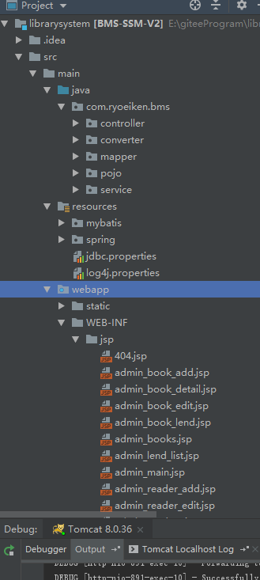

管理员：

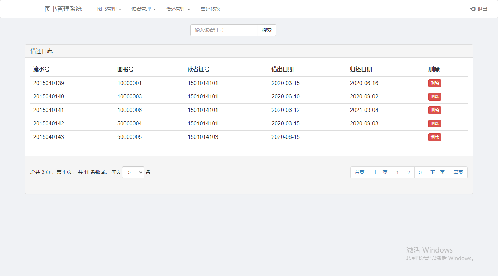

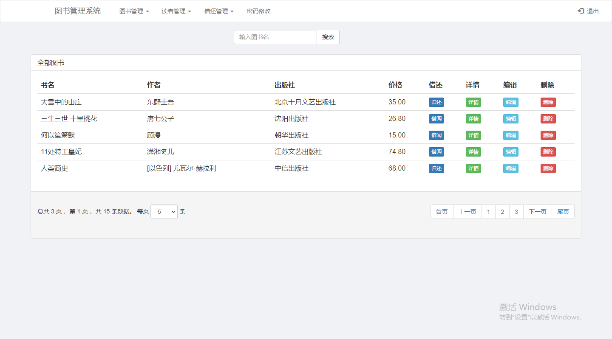

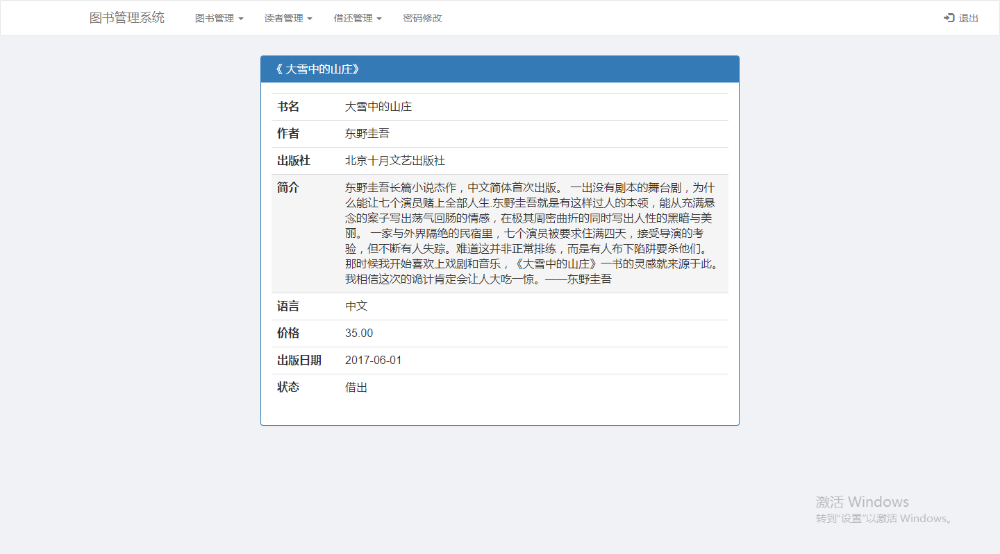

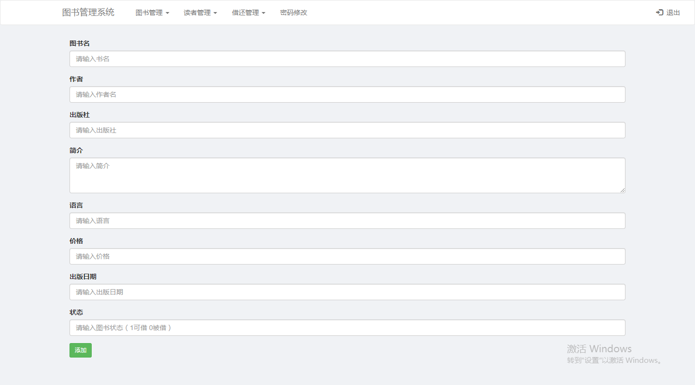

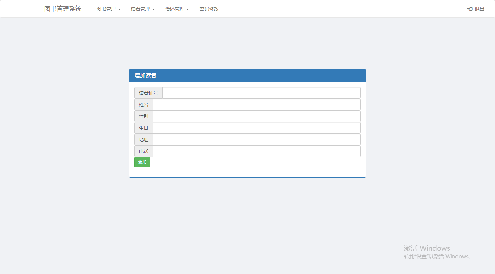

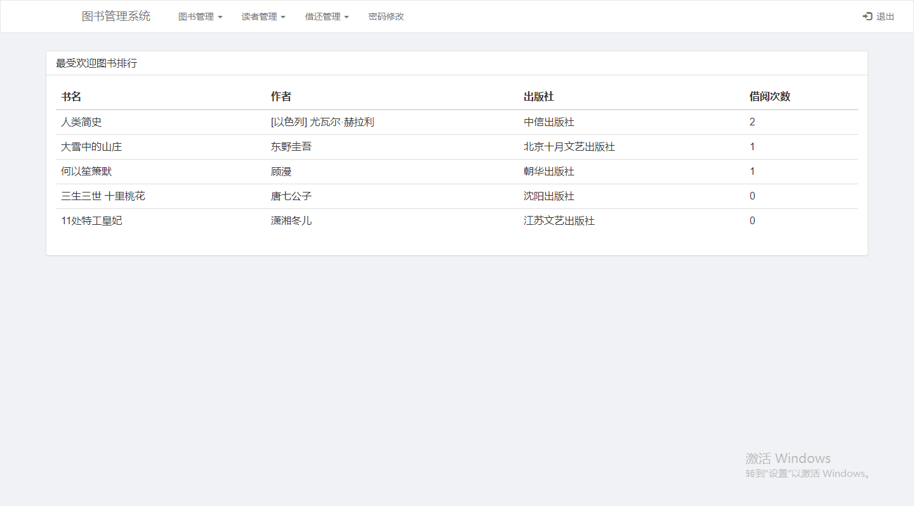

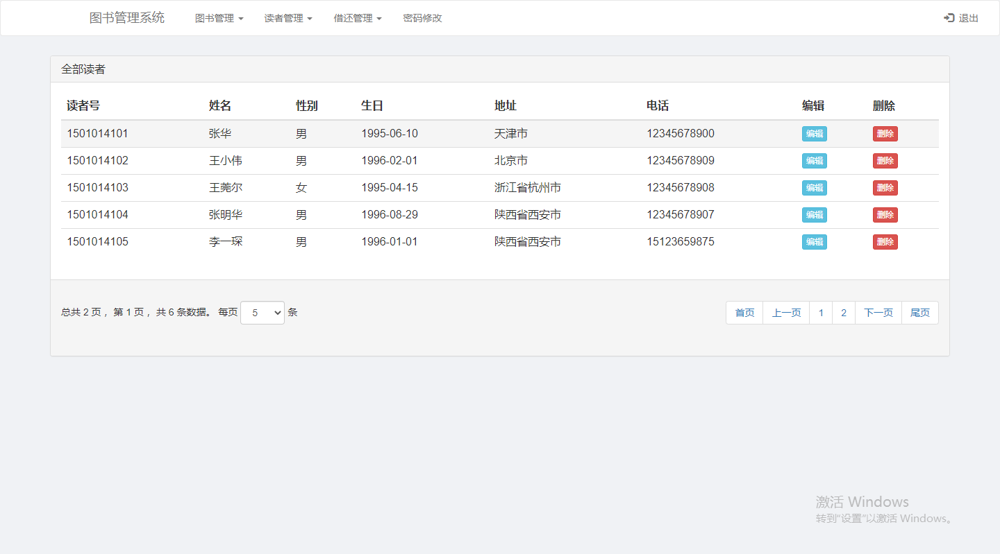

用户：

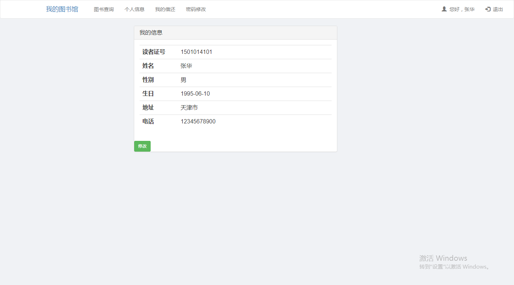

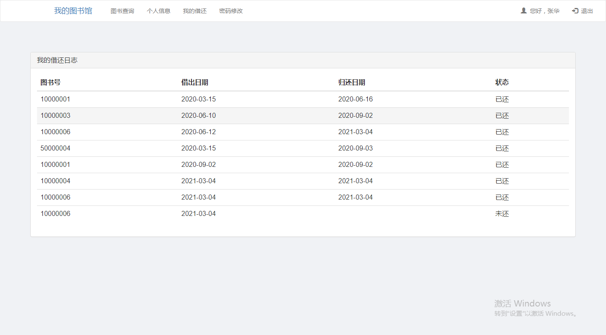

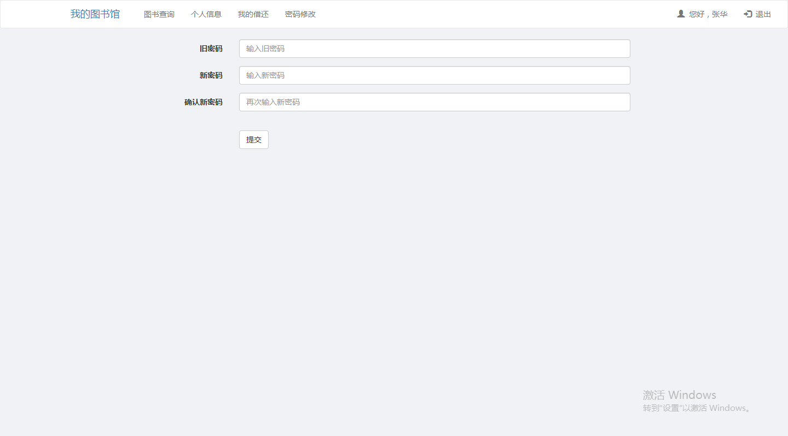

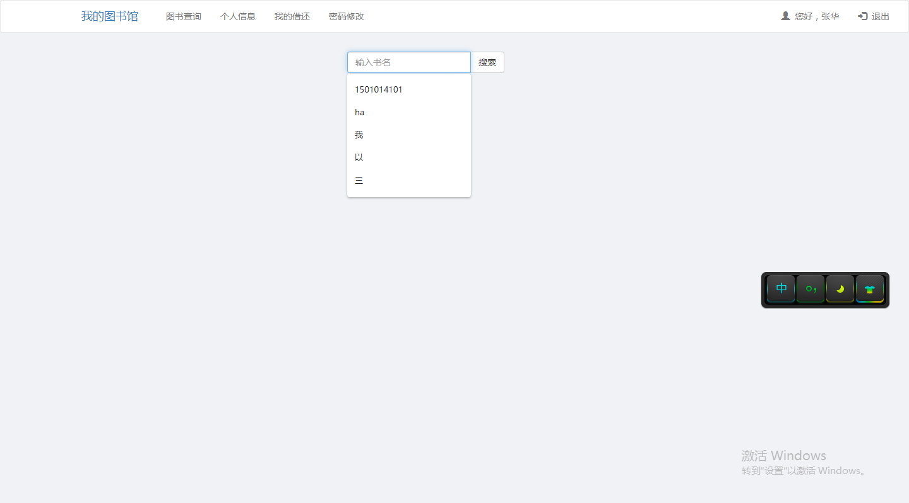

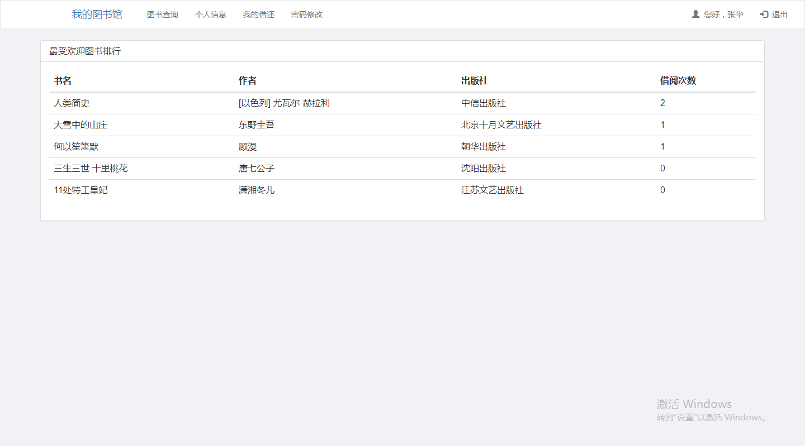

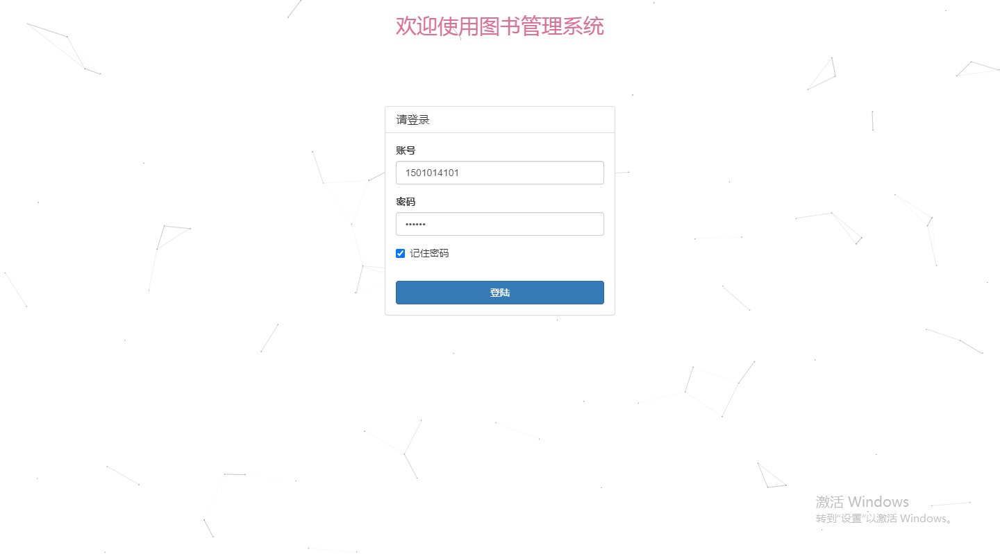
